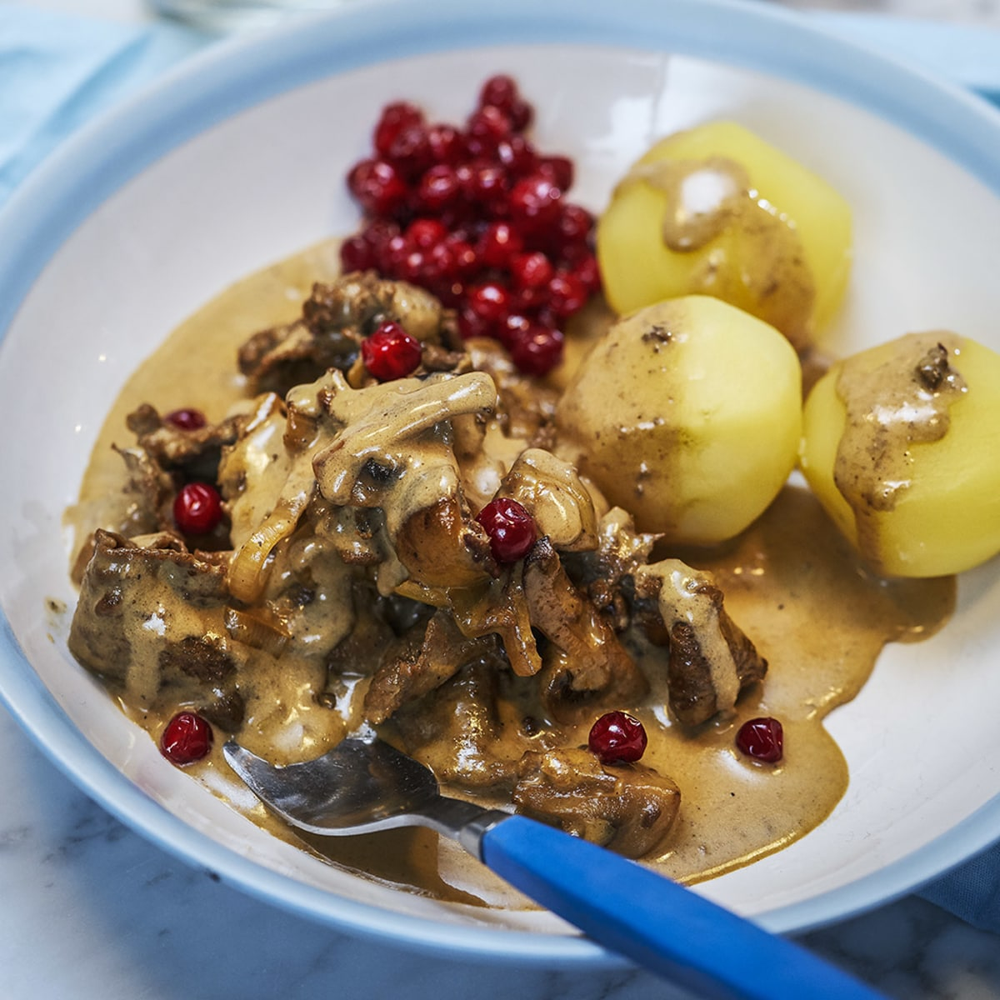

# Renskav

**Tidsåtgång: 40 minuter**

**Svårighet: lätt**

En gryta på renskav. Serveras med lingonsylt och antingen kokt potatis eller klyftpotatis i ugn.

## Ingredienser

- [ ] Renskav
- [ ] Grädde
- [ ] Enbär
- [ ] Salt
- [ ] Vitpeppar
- [ ] Potatis
- [ ] Lingonsylt
- [ ] (Valfri) Köttbuljong
- [ ] (Valfri) Kantareller
- [ ] (Valfri) Soja
- [ ] (Valfri) Gelé
- [ ] (Valfri) Maizena eller vetemjöl
- [ ] (Valfri) Lantchips (brynt smör & dill)

## Checklista

- [ ] Hacka lök
- [ ] Förbered potatisen
- [ ] Bryn renskaven tillsammans med löken
- [ ] Sätt igång potatisen
- Häll i...
  - [ ] Grädde
  - [ ] Salt
  - [ ] Vitpeppar
  - [ ] Gelé
  - [ ] Enbär
  - [ ] Köttbuljong
  - [ ] Kantareller
  - [ ] Soja
- [ ] Sätt en timer på minst 30 minuter

Renskaven är klar när potatisen är det, och blir bara mörare om den får stå längre. Det viktiga är att kolla potatisen.

